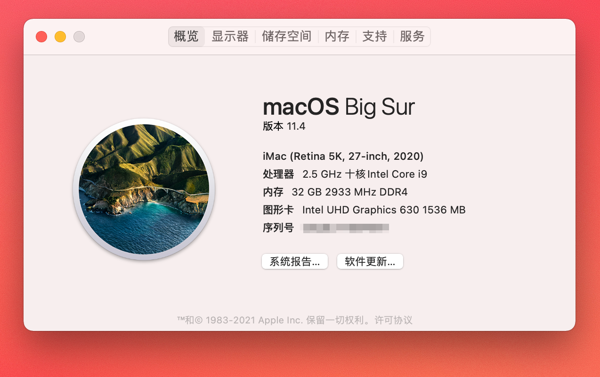

# Hackintosh-10900ES-B460M-MORTAR
Hackintosh OpenCore EFI, i9 10900es, MSI MAGB460M Mortar, iGPU UHD 630, BCM94360CS

男士自用一手 EFI

#### ！！！一定要用 **GenSMBIOS** 生成自己的序列号，替换 cconfig.plist 里的对应内容
#### ！！！一定要用 **GenSMBIOS** 生成自己的序列号，替换 cconfig.plist 里的对应内容
#### ！！！一定要用 **GenSMBIOS** 生成自己的序列号，替换 cconfig.plist 里的对应内容

## 更新

OpenCore 版本每到 x.x.1 和 x.x.6 会更新 EFI

- 2022.1.23：升级 OpenCore 0.7.7，修复未找到板载声卡的问题
  
  - 卸载了上次安装的蓝牙脚本
  - 开机后蓝牙还是连接有些慢，但基本上已经不影响使用了。
  - 睡眠唤醒后需要等待蓝牙重新连接，时间较长
  
- 2021.12.26:  升级 Monterey 后发现 USB工作异常，蓝牙休眠唤醒后无法使用

  - 重新定制USB。
  - 蓝牙在休眠唤醒问题按照 [这里](https://github.com/Mintimate/SleepAndAutoBluetoothAndWifi) 解决。试了各种方法，只有这种有效。

- 2021.12.18：升级 MacOS Monterey 12.1 与 OpenCore 0.7.6，更新驱动到最新版本。

  - > 前几天收了一块蓝宝石的 **RX560** 所以后面我都会出一个使用 **dGPU** 的 `config.dgpu.plist`，用的时候改名覆盖 `config.plist` 即可

## 电脑信息

|  - | 型号  |
|:----------|:----------|
| CPU      | INTEL i9 10900es (QTB1) |
| 主板      | 微星 MSI B460M Mortar （bios：E7C82IMS.140）  |
| 内存      | 光威 Gloway DDR4 3000MHz TYPE-α 16GB*2    |
| 显卡      | 集成 iGPU UHD 630 / 蓝宝石 RX560 |
| 储存      | WD SN750 1T |
| 网卡      | 主板集成 RTL8125 2.5G  |
| 无线网卡   | 苹果免驱 BCM94360CS ，转接插在M2口使用 |
| 系统      | MocOS big Sur 11.4    |

- 2021.11.02 把 光威 Gloway DDR4 3000MHz TYPE-α 换成 英睿达 DDR4 3200 16G*2，解决了偶尔蓝屏的问题
- 2021.09.06 收了一块蓝宝石 RX560

### 功能
- [x]  [睡眠](https://github.com/Mintimate/SleepAndAutoBluetoothAndWifi)/唤醒（bios关闭usb唤醒，睡眠后用电源键唤醒）
- [x]  定制USB端口（前置USB保留3.0，删除2.0，后面板USB都可用）
- [x]  Airdrop/Handoff/iMessage/
- [x]  核显硬件加速
- [x]  声卡输出
- [x]  以太网
- [x]  蓝牙/WiFi
- [x]  DP 4K输出
- [ ]  Sidecar（没有iPad没测试）

## Tools 工具

- [ProperTree](https://github.com/corpnewt/ProperTree)
- [GenSMBIOS](https://github.com/corpnewt/GenSMBIOS)
	- 选择 iMac20,1 SMBIOS
	- `Type` 复制到 `Generic -> SystemProductName`
	- `Serial` 复制到 `Generic -> SystemSerialNumber`
	- `Board Serial` 复制到 `Generic -> MLB`
	- `SmUUID` 复制到 `Generic -> SystemUUID`
- [Hackintool](https://github.com/headkaze/Hackintool/releases)
	- 黑苹果工具箱

## BIOS 设置

### 版本 7C82v14 

### 一键设置黑苹果
微星 Bios 里有 `D.T.M` 选项，只要打开就回把所有黑果用的设置，设置好。不用在手动一一设置。
 

## 安装

- 按照 `OpenCore` 官方的创建USB安装启动器的教程创建USB安装盘
- U盘一定要插在主板背面的 USB2.0上，否则会出现 `安装器已损坏` 或 `无法载入更新` 的错误

## 其它问题

1. 引导界面按空格键可以显示隐藏选项，便于Reset NVRAM等等；
2. 引导界面用Ctrl+回车可以更改默认的引导系统，比如想默认Windows可以把光标停到Win图标按Ctrl+回车；
3. 休眠有问题的，使用Hackintool选择电源选项卡点击下方的螺丝刀图标即可修复；

## 系统截图

